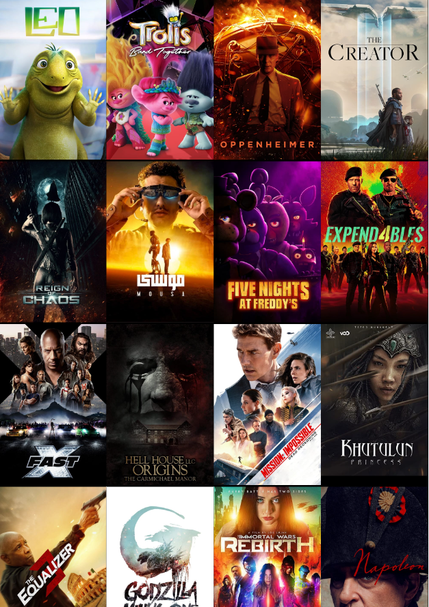
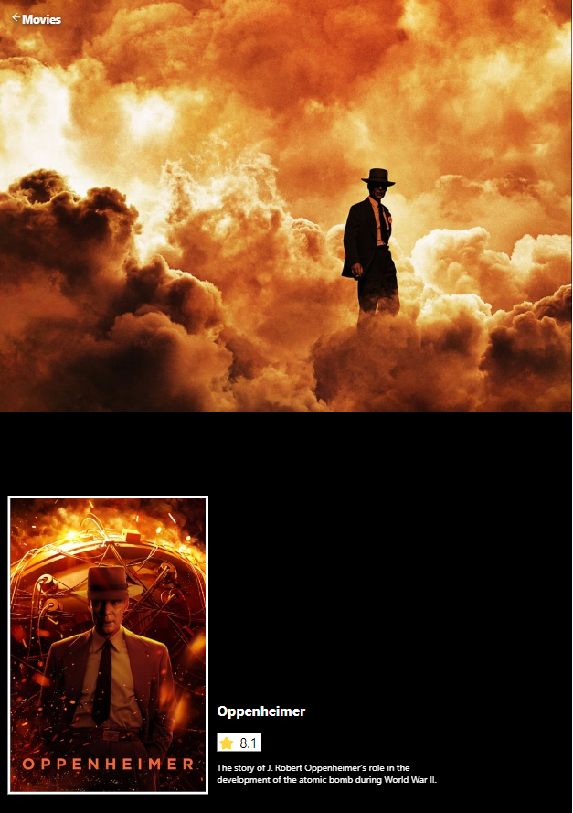

# Movie Site Project




## Getting Started with the Project

### Dependency Installation & Startup Development Server

Once cloned, navigate to the project's root directory and this project uses npm (Node Package Manager) to manage its dependencies.

The command below is a combination of installing dependencies, opening up the project on VS Code and it will run a development server on your terminal.

```bash
npm i && code . && npm run dev
```

### The Problem

Describe how you approached to problem, and what tools and techniques you used to solve it. How did you plan? What technologies did you use? If you had more time, what would be next?

### View it live

link: https://olcay-movie-site.netlify.app/

## Instructions

<a href="instructions.md">
   See instructions of this project
  </a>
